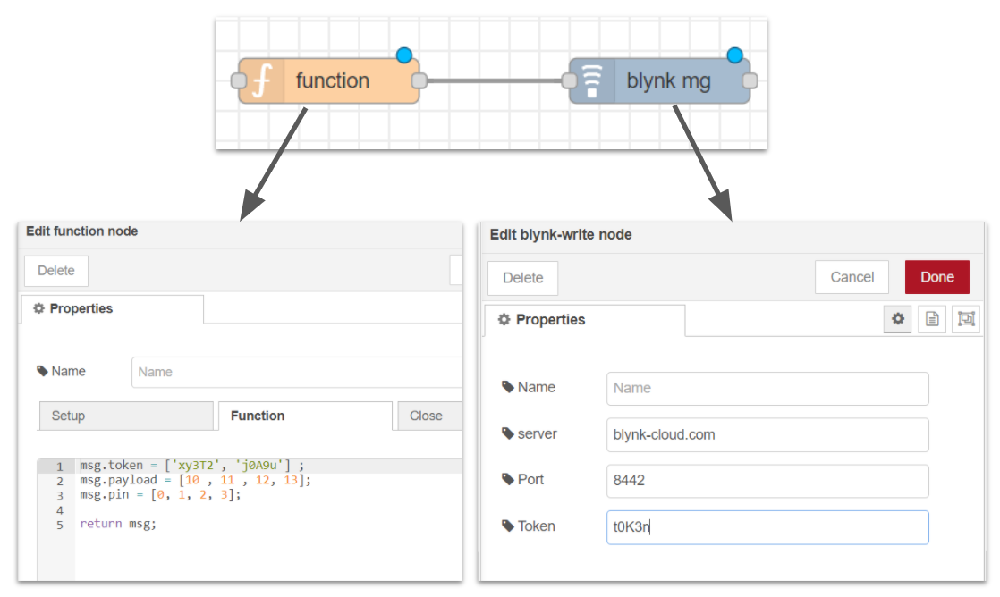

# node-red-contrib-blynk-mg
a simple node-red Blynk node with flexible token and pins configuration
 
[](https://travis-ci.org/joemccann/dillinger)

you can also check the [npmjs package page](https://www.npmjs.com/package/node-red-contrib-blynk-mg).

# Description!

  Thip node-red package allows users to pass Blynk token and pin as part of the message. For instance:

  ```
msg = {
    'token' : ['token1', 'token-2'],
    'payload' : ['value-0' , 'value-1' , 'value-2', 'value-3'],
    'pin' : [0, 1, 2, 3]
    }   
```
  When the above message is recieved, the node will send the payload 4 messages, to the pin list, one for each pin. all messages will be sent to each token in the msg.token list.

  If msg.payload is longer than msg.pin => the node will send the first payload messages until pins list is used.
  
  | list        | v 1                     |  v 2                   |  v 3 | v 4  |
  |-------------|-------------------------|------------------------|------|------|
  | msg.payload | pl_0                    | pl_1                   | pl_2 | pl_3 |
  | msg.pin     | 0                       | 1                      |      |      |
  | result      | send 'pl_0'  to v_pin_0 | send 'pl_1' to v_pin_1 |      |      |

  if msg.pin is longer than payload => the node will send 0 for the pins that has no match in payload list.
  
  | list        | v 1                     | v 2                    | v 3                | v 4                |
  |-------------|-------------------------|------------------------|--------------------|--------------------|
  | msg.payload | pl_0                    | pl_1                   |                    |                    |
  | msg.pin     | 0                       | 1                      | 2                  | 3                  |
  | result      | send 'pl_0'  to v_pin_0 | send 'pl_1' to v_pin_1 | send 0 to  v_pin_2 | send 0 to  v_pin_3 |

  If a token is added to the node config view, this token will be appended to the msg.token list.

  

# Installation
in the (Node-red)[] installation directory run this command:

```
$ npm i node-red-contrib-blynk-mg
```


# Todos for next releases

 - improve the user experience and how the msg is consumed.
